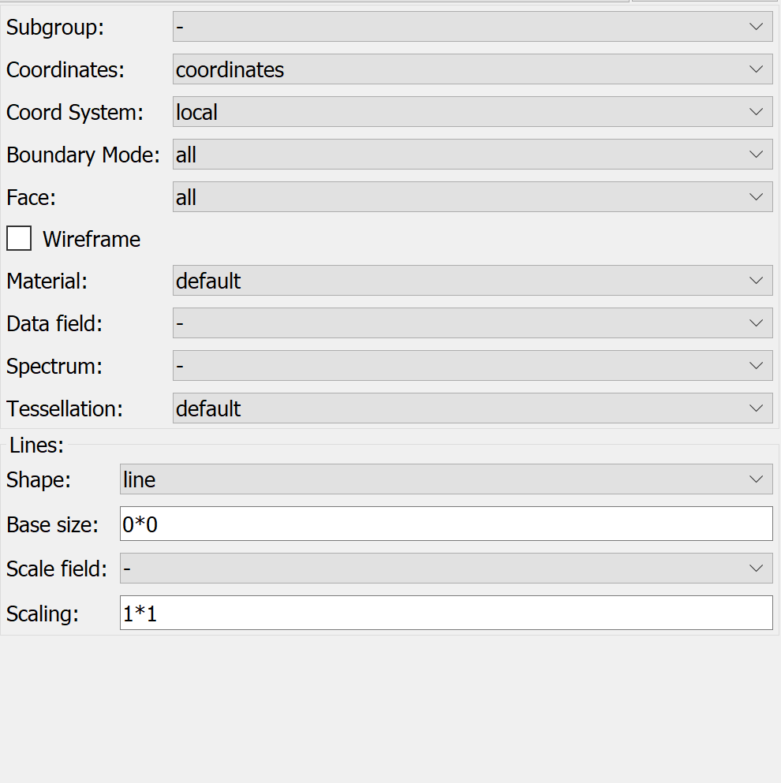

Graphics Editor Widget
======================

The **Graphics Editor Widget** is a control to add, remove, and modify the graphics of a scene.

.. _fig-opencmiss-zincwidgets-graphics-editor-widget:

   Graphics editor widget.

Settings editor
---------------

The settings editor is where each graphic is set up.
It contains a number of controls.

* Subgroup: This drop down menu allows you to select the subgroup of current graphic.
* Coordinates: This drop down menu allows you to select the coordinate of current graphic.
* Coord System: This drop down menu allows you to select the coordinate system of current graphic.
* Boundary Mode: This drop down menu allows you to select the boundary mode of current graphic.
* Face: This drop down menu allows you to select the face of current graphic.
* Wireframe: This checkbox allows you to set if the graphic is displayed in a skeletal three-dimensional model in which only lines and vertices are represented.
* Material: This drop down menu allows you to select material for current graphic.
* Data field: This drop down menu allows you to select data field for current graphic.
* Spectrum: This drop down menu allows you to select spectrum for current graphic.
* Tessellation: This drop down menu allows you to select tessellation for current graphic.

If the graphic is a line:

* Shape: This drop down menu allows you to select shape for current line graphic.
* Base size: This text box allows you to set the base size for line graphic, format as number*number.
* Scale field: This drop down menu allows you to select scale field for current line graphic.
* Scaling: This text box allows you to set the scaling for line graphic, format as number*number.

If the graphic is a point:

* Glyph: This drop down menu allows you to select glyph for current point graphic.
* Base size: This text box allows you to set the base size for point graphic, format as number*number*number.
* Scale field: This drop down menu allows you to select scale field for current point graphic.
* Scaling: This text box allows you to set the scaling for point graphic, format as number*number*number.
* Label field: This drop down menu allows you to select label field for current point graphic.
* Sampling mode: This drop down menu allows you to select sampling mode for current point graphic.

API
---

.. autoclass:: opencmiss.zincwidgets.graphicseditorwidget.GraphicsEditorWidget
   :members:
