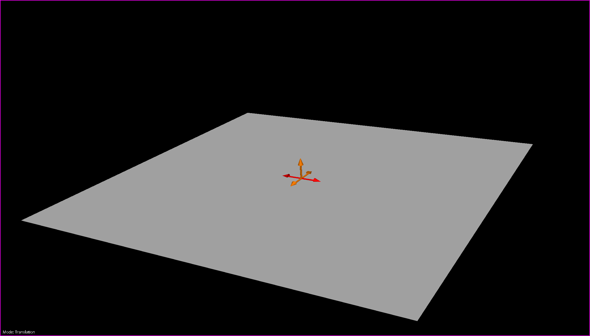

Fixed Axis Translation Handler
==============================

The **Fixed Axis Translation Handler** is a Zinc handler for controlling the position of surface graphics within a Zinc ``Scene``.

The ``FixedAxisTranslation`` handler extends the ``KeyActivatedHandler`` class. Any Python code creating a ``FixedAxisTranslation``
handler instance should specify a `Qt` key constant identifying which keyboard key will activate the handler.

To be able to use the `Fixed Axis Translation` handler with a `Zinc` `Scene`, the code must also set a model for the handler using its
``set_model`` method. The handler's model keeps track of the surface normal and surface vertices, and should provide methods for the
handler to get and set these attributes. For more information on what the handler requires of a model please read the
:ref:`API section <translation-handler-api>` below.

While active, the `Fixed Axis Translation` handler will allow the user to reposition the surface graphics within the scene viewer. A set of
translation arrows will be displayed in the centre of the surface graphic, with two arrows for each Cartesian axis. These arrows can be
clicked and dragged to translate the surface graphic in the direction they specify.

.. _fig-cmlibs-widgets-translation-handler:

   `Fixed Axis Translation` handler with translation arrows at surface centre.

.. note::
    Currently only square surface graphics are supported, due to limitations with the translation vector calculations.

.. _translation-handler-api:

API
---

.. autoclass:: cmlibs.widgets.handlers.fixedaxistranslation.FixedAxisTranslation
   :members:
