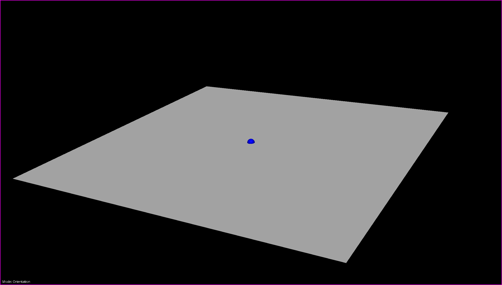
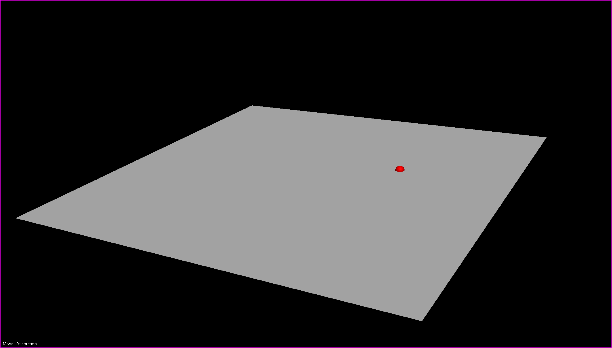

Orientation Handler
===================

The **Orientation Handler** is a Zinc handler for controlling the orientation of surface graphics within a Zinc ``Scene``.

The ``Orientation`` handler extends the ``KeyActivatedHandler`` class. Any Python code creating an ``Orientation`` handler instance should
specify a `Qt` key constant identifying which keyboard key will activate the handler.

To be able to use the `Orientation` handler with a `Zinc` `Scene`, the code must also set a model for the handler using its ``set_model``
method. The handler's model keeps track of the current rotation point and surface normal, and should provide methods for the handler to
get and set these attributes. For more information on what the handler requires of a model please read the
:ref:`API section <orientation-handler-api>` below.

While active, the `Orientation` handler will allow the user to rotate the surface graphic specified by the model around a rotation point -
by clicking and dragging the mouse within the scene viewer. The rotation point is indicated by a blue sphere. Generally, this point will be
positioned in the centre of the surface by default, but will depend on the model's ``get_rotation_point`` implementation.

.. _fig-cmlibs-widgets-orientation-handler-1:

   `Orientation` handler with rotation point in the centre of the surface graphic.

It is also possible for the user to re-position the rotation point by selecting and dragging it to a new position on the surface.

.. _fig-cmlibs-widgets-orientation-handler-2:

   `Orientation` handler with custom rotation point.

.. _orientation-handler-api:

API
---

.. autoclass:: cmlibs.widgets.handlers.orientation.Orientation
   :members:
