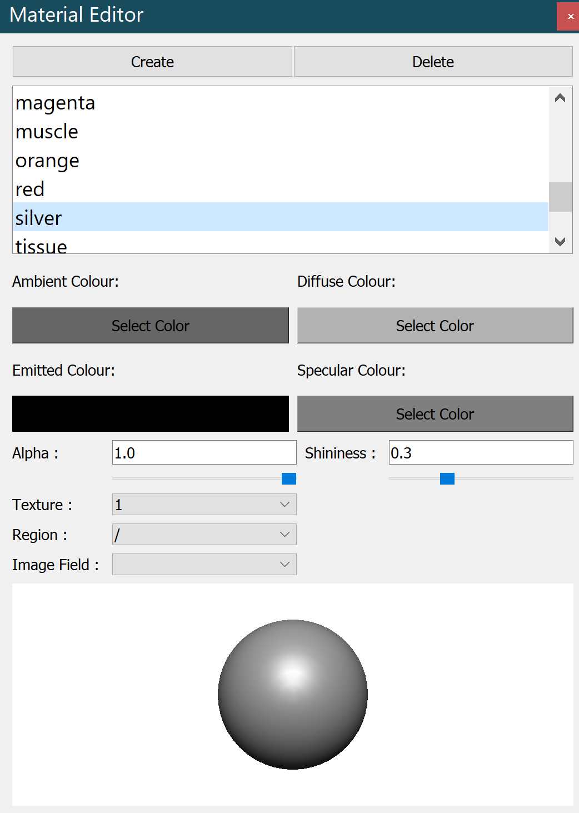

Material Editor Widget
======================

The **Material Editor Widget** is a control to add, remove, and modify materials.

.. _fig-opencmiss-zincwidgets-material-editor-widget:

   Material editor widget.

Material list
-------------

The material list displays all currently defined materials; it will always contain the default material if no other materials are defined.
The two buttons at the top of the window allow you to create or delete materials.

Settings editor
---------------

Below the material list are controls that allow you to set some general properties of the selected material.
Ambient Color, Diffuse Color, Emission Color, and Specular Color. 
You can also adjust the alpha and shininess of the material by entering a number between 0 and 1 or dragging the sliders.

Preview panel
-------------

This panel displays a sphere, shaded with the selected material.

API
---

.. autoclass:: opencmiss.zincwidgets.materialeditorwidget.MaterialEditorWidget
   :members:

.. autoclass:: opencmiss.zincwidgets.materialeditorwidget.MaterialModel
   :members: