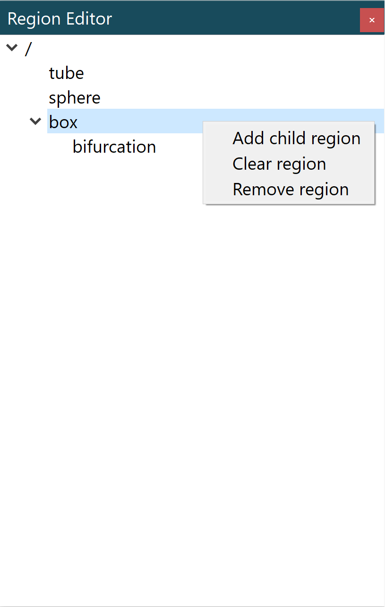

Region Editor Widget
====================

The **Region Editor Widget** is a control to add, remove, and modify the region structure of a context.

.. _fig-cmlibs-widgets-region-editor-widget:

   Region editor widget.

Region Tree
-----------

This tree view shows the region structures. You can create new regions by right-clicking on the parent region of the new region. 
From the popup menu select the add child region entry. 
You can rename a region by double-clicking on the region and entering an alpha-numeric value. 
You can remove a region by right-clicking on the region and select remove region on the popup menu.

API
---

.. autoclass:: cmlibs.widgets.regioneditorwidget.RegionEditorWidget
   :members:

.. autoclass:: cmlibs.widgets.regioneditorwidget.RegionTreeModel
   :members: