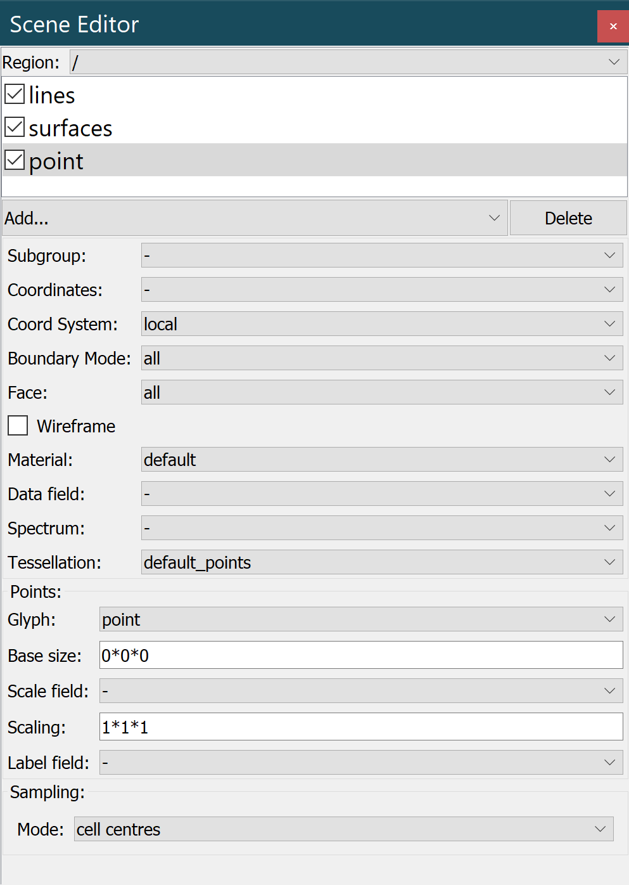

Scene Editor Widget
===================

The **Scene Editor Widget** is a control to add, remove, and modify the graphics of a scene.

.. _fig-cmlibs-widgets-scene-editor-widget:

   Scene editor widget.

Graphics list
-------------

The graphics list displays all the defined graphics in the current scene, each with a checkbox in front of it. 
This checkbox allows you to set whether to display this graphic.
Above the chart list is a region selector that allows you to select the region of current scene.
Below the list of graphics, there is a drop-down menu that allows you to add a new graphic.
There is also a button that allows you to delete the selected graph.

API
---

.. autoclass:: cmlibs.zincwidgets.sceneeditorwidget.SceneEditorWidget
   :members: