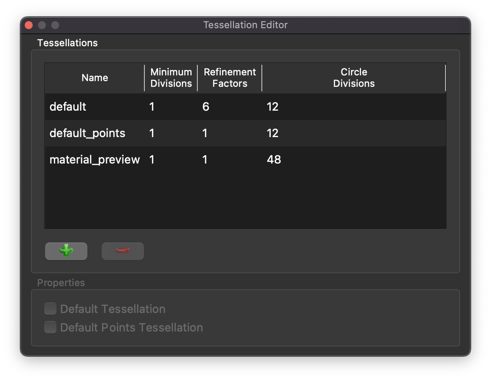

Tessellation Editor Widget
==========================

The **Tessellation Editor Widget** is a control to add, remove, and edit tessellations.

.. _fig-opencmiss-zincwidgets-tessellation-editor-widget:

   Tessellation editor widget.

The tessellation editor widget lists the currently defined tessellations.
The tessellations are listed with their current settings.
The button with the green cross adds a new tessellation and adds it to the list of tessellations.
The button with the red minus removes a tessellation from the list of tessellations.
The remove button is only enabled when a tessellation is activated (selected).
The properties of a selected tessellation can also be set.
The default tessellation and default points tessellation properties can be set on the currently selected tessellation.
