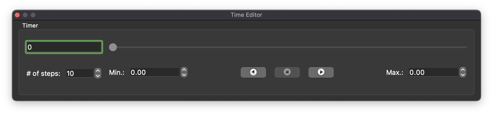

Time Editor Widget
==================

The **Time Editor Widget** is a control to manipulate and observe the current time value and time limits.

.. _fig-cmlibs-widgets-time-editor-widget:

   Time editor widget.

The time editor widget has eight interfaces that modify the time management of the current context.
The interfaces available are:

* Current time edit
* Current time slider
* Number of steps
* Minimum time
* Play reverse button
* Stop button
* Play forward button
* Maximum time

The current time edit and current time slider display the value of the current time held by the time keeper.
The number of steps value determines how many steps the time keeper takes from the minimum time to the maximum time, inclusive.
The minimum time indicates the minimum time for the time keeper.
The minimum time can be manually edited.
The minimum time is initially set from the time keeper.
The minimum time cannot be greater than the maximum time.
The play reverse button starts the time keeper updating time according to the current time step and runs time backwards.
The stop button stops the time changing if the current time is changing.
The play forward button starts the time keeper updating time accoriding to the current time step and runs time forward.
The maximum time indicates the maximum time for the time keeper.
The maximum time can be manually edited.
It is initially set from the time keeper.
The maximum time cannot be less than the minimum time.

API
---

.. autoclass:: cmlibs.widgets.timeeditorwidget.TimeEditorWidget
   :members:
